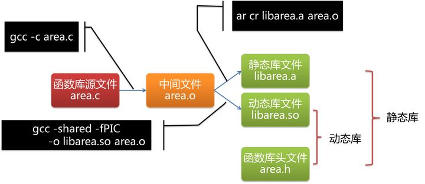

# 编译

## 参考

- [编译、连接、.h文件和.lib文件、.dll文件还有.o文件是什么关系？他们各有什么作用？](https://www.zhihu.com/question/20783462?sort=created)
- Advanced C and C++ Compiling》

## 操作

- 编译，把 .cpp, .h, .hpp 编译成目标平台对应的二进制目标文件 .o
- 链接，关联上目标文件 .o 和库文件 .a .lib

## 文件类型

- .h 头文件，是普通文件，特殊后缀名，也可以理解为类的接口
- .o 编译产生的目标文件，面向当前机器的二进制文件，当前平台的机器码
- .exe 可执行文件，链接所有 .o 文件后的二进制文件
- .a .lib 静态库文件，和 .o 类似，一般用来表述别人代码编译产生的结果
- .dll 动态库文件，和静态库的差别是 .a 在链接时并入 .exe，dll 在 .exe 运行时使用

## Linux 下的文件类型

