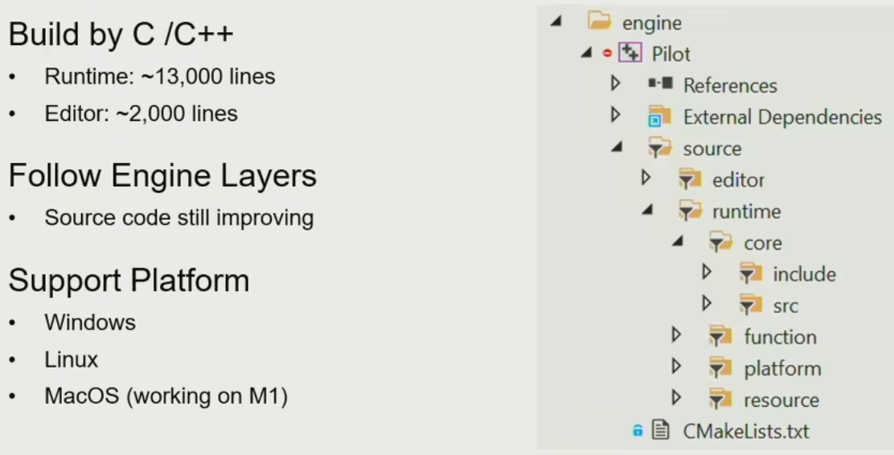
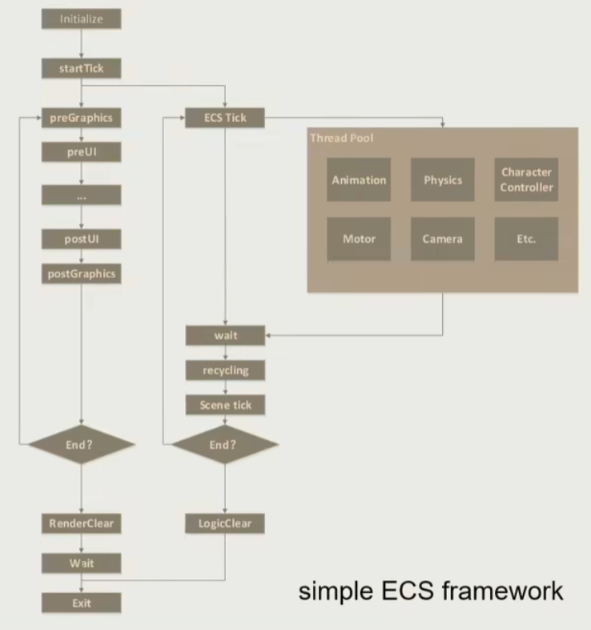

# GAMES104-现代游戏引擎: 从入门到实践

## 第一节：游戏引擎导论

### 历史

Engine ，商业，inhouse，免费
Middlewares 中间件公司

### 游戏引擎

制作游戏的框架和工具合集

世界中的无限细节

### Complexity of Simulation

Combat

**Interaction**

Reaction

**Net Sync**

Prediction

Render

- Animation
- **Motor**
- *Camera
- Effect**
- Cloth
- **Sound**

### Developer Platform

为了艺术家，设计师，程序员设计工具

非常复杂的工具

#### 如何学习游戏引擎

需要学习几乎所有计算机科学知识

学习路径：沿着主干道前进

#### MVVM 模型

#### Cause about

- Render
- Animation
- Physics
- Gameplay （Game World Rules）
- MIsc Systems
  - Effects
  - Navigation
  - Camera

#### Tool Set

- C++ Reflection
- Data Schema

#### Online Gameing

- Lockstep Synchronization
- State Synchronization

#### Advanced Technology

- Motion Matching
- Procedural Content Generation
- Data-Oriented Programming
- Job System
- Lumen
- Nanite

#### References

- No required textbooks
- Game Engine Architecture

#### Mini Engine

- Mini runtime framework
- Mini editor
- Building basic knowledge system of game engine

#### 作业目标

联网对战游戏

## 第二节：引擎架构分层

### 游戏引擎分层简介

#### Layers

- Tool Layer
- Function Layer
- Resource Layer
- Core Layer
- Platform Layer
- 3rd Party Libraries

5 + 1 层次涵盖了几乎所有引擎功能

#### Chans of Editor

- Editor GUI

#### Make it visible movable and playable

- Physics
- Animation
- Rendering
- Camera HUD and Input
- Script FSM and AI

#### Data and Files

#### Swiss Knife of Game Engine

#### Launch on Different Platforms

- Operation Systems
- Platform File Systems
- Graphics API
- Platform SDK

etc

- Consoles
- Input Devices
- Publishing Platforms

#### Practice

make an animate character

### Resource Layer

- How to Access My Data
  - Resource -> asset
- Rentime Asset Manager
- Manage Asset Life Cycle

### Function Layer

- How to Make the world alive
- 
- 每个 Tick 进行一遍所有的系统执行

#### Dive into Tick

- tick logic 先世界模拟
- tick render 再进行渲染

#### Heavy - duty Hotchpotch

#### Multi-Threading

难点在 Dependency 管理

### Core Layer

#### Math Library

- math efficiency
- 倒数平方根很慢，quake 3 有一个近似算的很快
- SIMD ：专门做向量运算的组件，可以同时进行 4 次相加

#### Data Structure and Container

需要重新写游戏引擎手动控制的容器数据结构，因为语言自带的托管内存的数据结构所占据的内存会产生很多空洞，内存的消耗是不可控的。

出现很多内存碎片，访问效率很低。

#### Memory Management 内存管理

现代计算机的内存数据读写还是图灵机方式

高效的内存分配模式

- Put data together 数据在一块
- Access data in order 数据按顺序读写
- Allocate and de-allocate as a block 按照块状分配内存

#### Foundation of Game Engine

### Platform Layer

#### Target on Different Platform

需要做到平台无关性

- File system
- Graphic api
- Hardware Architecture 特定机器优化

### Tool Layer

#### Allow artists to create game

Manual Editors

- Level Editor
- Logical Editor
- Shader Editor
- Animation Editor
- UI Editor
- Flexible of coding languages

#### Digital Content Creation

Asset conditioning pipeline

tool chains

### Why Layered Architecture

- Decoupling and Reducing Complexity
- Response for Evolving Demands

### Mini Engine : Pilot

### Simple ECS framework

### Takeaways

- Engine is designed with a layered architecture
- Lower levels are more stable and upper levels are more customizable
- Virtual world is composed by a set of clocks - ticks

## 第三节：如何构建游戏世界

### 游戏世界中的物体

#### Dynamic Game Object

#### Static Game Object

#### Environment

- Sky
- Vegetation
- Terrain

#### Other Game Objects

- Air wall
- Trigger Area
- Ruler
- Navigation mesh

#### Everything is a Game Object

### How to Describe a GameObject

- Name
- Property

  - Shape
  - Position
  - Capacity of battery
- Behavior

  - Move
  - Scout

##### OOP

通过面向对象的方式描述游戏物体，实际上的现实中的物体不是清晰的树状派生关系，而是组合居多

##### Component Base

组件化，通过组件组合成游戏对象

#### Takeaways

- Everything is a game object in the game world
- Game object could be described in the component-based way

### Make world alive

- Object-based Tick
- Tick 的执行是遍历同类型的每个个体，而不是同个体的每个类型
- 按照流水线的做法比较高效

### Interactive

- Events
- Interface
- 可拓展的消息系统

#### Manage Game Object

- Game object uid
- position
- Scene management 空间管理的核心
  - No division
  - Divided by grid
    - Quadtree
  - Hierarchical segmentation 树状结构划分

#### 复杂情况

- GO Binding，父子节点情况，时序很重要，因为有并行情况
  - 逻辑上的混乱性，而好的程序执行是确定性的
  - 挑战性是在多线程情况下执行还是确定性的
  - 需要有同步点，GameObject 间不能直接发送消息
  - 可能逻辑间有循环依赖，根据处理方式可能会导致延时情况

## 第四章：游戏引擎中的渲染实现

### 渲染概述

#### Challenges on Game Rendering

1. Complex render objects
2. Deal with architecture of modern computer with a complex combination of CPU and GPU
3. Commit a bullet-proof framerate, 
   1. 30 or 60 or 120 fps
   2. HD, 1080p, 4k, 8k
4. CPU memory

#### Rendering on Game Engine

A heavily optimized parctical software framework to fulfill the critical rendering requirements of games on modern hadware

#### Outline of Rendering

1. Basics of Game Rendering
   - Hardware architecture
   - Render data organization
   - Visibility
2. Materials, Shaders and Lighting
   - PBR
   - Shader permutation
   - Lighting
   - Point / Directional lighting
   - IBL / Simple GI
3. Special Rendering
   - Terrain
   - Sky / Fog
   - Postprocess
4. Pipeline
   - Forward, deferred rendering forward plus
   - Real pipeline with mixed effects
   - Ring buffer and V-Sync
   - Tiled-based rendering

### 渲染系统的对象

#### Computation - Texture Sampling

1. Use tow nearest mipmap levels
2. Perform bilinear inerpolation in both mip-maps
3. Linear interpolate between the results

### GPU 架构

The dedicated hardware to solve massive jobs

#### SIMD and SIMT

- SIMD 单指令多数据
- SIMT 单指令多线程
