# 庄懂-美术向 TA 课程

## 零

- 自我介绍 开课目的
- 课程内容 授课方式
- 课程特色 学习方法
- 学员抽取 分组
- 答疑

## 一

#### 抽象的渲染过程

模型 > input > vertex shader > output > fragment shader > color

#### 值结构g

- 标量 Scalar
- 向量 Vector

#### 乘

- dot
- cross

#### Lambert

- Max(0, nDir * lDir)

#### HalfLambert

- Lambert * 0.5 + 0.5

#### 调子映射

- 将半 Lambert(0~1) 的调子视为 uv 坐标的 u 坐标，再附加一个常量作为 v 轴，得到的 uv 坐标对 RampTex 采样，假SSS的透光效果。

## 二

#### 卡通渲染

- 卡通渲染不止一种风格
- 技术不止一种风格
  - 
  - 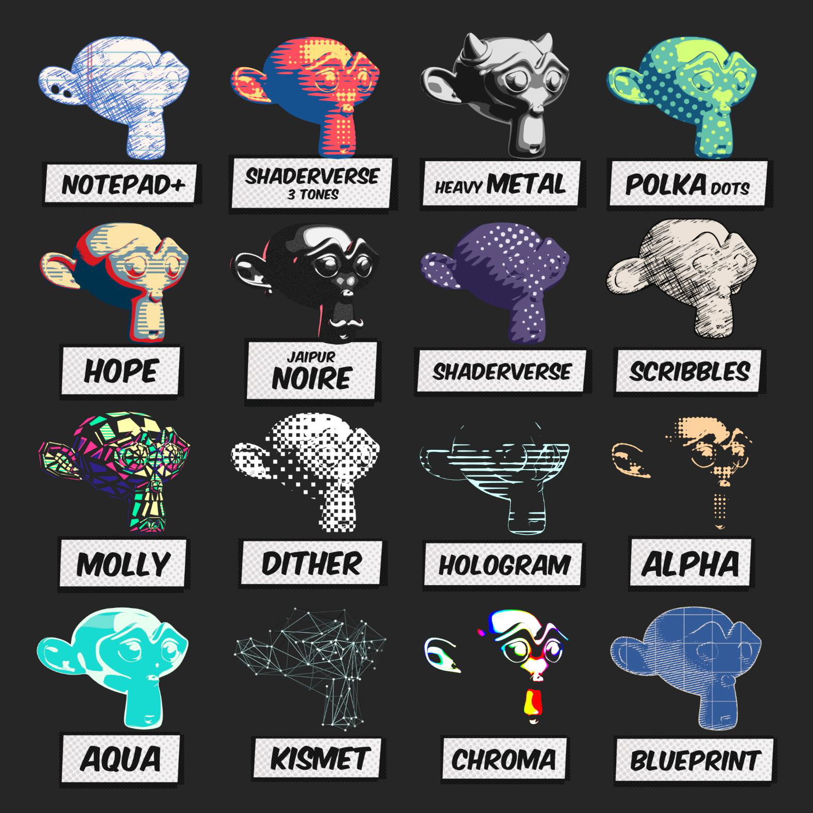
- 常用技术 · Cell / ToonShading
  - [罪恶装备](https://gdcvault.com/play/1022031/GuiltyGearXrd-s-Art-Style-The)
  - [火影·究极风暴](http://psv.tgbus.com/news/ynzx/201306/20130603141025.shtml)
- 常用技术 - HatchingShading

  - 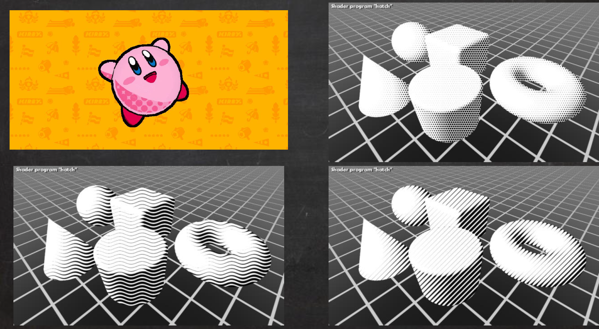

  - 

#### 规范

- 路径规范
- 命名规范
- 提交形式规范

##  三

#### Lambert

- 渲染流程

- 关联编辑器

- SF 新建最简 Shader 模板

  

- HelloWorld
  
```clike
Shader "AP1/L03/Lambert"
{
    Properties {}
    SubShader
    {
        Tags
        {
            "RenderType"="Opaque"
        }
        Pass
        {
            Name "FORWARD"
            Tags
            {
                "LightMode"="ForwardBase"
            }
            CGPROGRAM
            #pragma vertex vert
            #pragma fragment frag
            #include "UnityCG.cginc"
            #pragma multi_compile_fwdbase_fullshadows
            #pragma target 3.0
            // 输入结构
            struct VertexInput
            {
                float4 vertex : POSITION; // 将模型顶点信息输入进来
                float4 normal : NORMAL; // 将模型法线信息输入进来
            };

            // 输出结构
            struct VertexOutput
            {
                float4 pos : SV_POSITION; // 由模型顶点信息换算而来的顶点屏幕位置
                float3 nDirWS : TEXCOORD0; // 由模型法线信息换算来的世界空间法线信息
            };

            // 输入结构>>>顶点Shader>>>输出结构
            VertexOutput vert(VertexInput v)
            {
                VertexOutput o = (VertexOutput)0; // 新建一个输出结构
                o.pos = UnityObjectToClipPos(v.vertex); // 变换顶点信息并将其塞给输出结构
                o.nDirWS = UnityObjectToWorldNormal(v.normal); // 变换法线信息并将其塞给输出结构
                return o; // 将输出结构输出
            }

            // 输出结构>>>像素
            float4 frag(VertexOutput i) : COLOR
            {
                float3 nDir = i.nDirWS; // 获取nDir
                float3 lDir = _WorldSpaceLightPos0.xyz; // 获取lDir
                float nDotl = dot(i.nDirWS, lDir); // nDir点积lDir
                float lambert = max(0.0, nDotl); // 截断负值
                return float4(lambert, lambert, lambert, 1.0); // 输出最终颜色
            }
            ENDCG
        }
    }
    FallBack "Diffuse"
}
```


## 四

#### HalfLambert

```c
            // 输入结构
            struct VertexInput
            {
                float4 vertex : POSITION; // 将模型顶点信息输入进来
                float4 normal : NORMAL; // 将模型法线信息输入进来
            };

            // 输出结构
            struct VertexOutput
            {
                float4 pos : SV_POSITION; // 由模型顶点信息换算而来的顶点屏幕位置
                float3 nDirWS : TEXCOORD0; // 由模型法线信息换算来的世界空间法线信息
            };

            // 输入结构>>>顶点Shader>>>输出结构
            VertexOutput vert(VertexInput v)
            {
                VertexOutput o = (VertexOutput)0; // 新建一个输出结构
                o.pos = UnityObjectToClipPos(v.vertex); // 变换顶点信息 并将其塞给输出结构
                o.nDirWS = UnityObjectToWorldNormal(v.normal); // 变换法线信息 并将其塞给输出结构
                return o; // 将输出结构 输出
            }

            // 输出结构>>>像素
            float4 frag(VertexOutput i) : COLOR
            {
                float3 nDir = i.nDirWS; // 获取nDir
                float3 lDir = _WorldSpaceLightPos0.xyz; // 获取lDir
                float nDotl = dot(i.nDirWS, lDir); // nDir点积lDir
                float halfLambert = nDotl * 0.5 + 0.5; // 映射至0~1
                return float4(halfLambert, halfLambert, halfLambert, 1.0); // 输出最终颜色
            }
```

#### 预积分

- 预积分皮肤渲染：Pre-Integrated Skin Shading
- 2 维的 RampTex，可以根据不同的情况采样不同的 RampTex

## 五

#### 漫反射和镜面反射

- 初中物理

  - 漫反射 ：Diffuse Reflection

  - 镜面反射 ： Specular Reflection 

- **黑话** 各种向量 （命名规范）
```
常用向量：（全要记）
• nDir：法线方向，点乘操作时简称n；
• lDir：光照方向，点乘操作时简称l；
• vDir：观察方向，点乘操作时简称v；
• rDir：光反射方向，点乘操作时简称r；
• hDir：半角方向(Halfway)，lDir和vDir的中间角方向，点乘操作时简称h；
所在空间：（暂时只记WS，其余看热闹）
• OS：ObjectSpace 物体空间，本地空间；
• WS：WorldSpace 世界空间；
• VS： ViewSpace 观察空间；
• CS：HomogenousClipSpace 齐次剪裁空间；
• TS：TangentSpace 切线空间；
• TXS：TextureSpace 纹理空间；
例：nDirWS：世界空间下的法线方向；
```

- 漫反射-Diffuse:
  - 因其向四面八方均匀散射，所以反射亮度和观察者看的方向无关；
  - 实现方式：Lambert（n dot l），显然vDir不参与计算；
- 镜面反射-Specular:
  - 因其反射有明显方向性，所以观察者的视角决定了反射光线的有无，明暗；
  - 实现方式：
    - Phong（r dot v），即光反射方向和视角方向越重合，反射越强；
    - Blinn-Phong（n dot h），即法线方向和半角方向越重合，反射越强；

#### Old School

- Lambert 漫反射 + Blinn-Phong 镜面反射
- 这样一个光照模型相对完善的Shader；这是一种上古套路，所以吾称之为OldSchool；

## 六

#### OldSchoolP

- Lambert+Phong

- ```
  6. 像素Shader需要修改：
      1. 向量准备：不需要hDir，但要追加rDir；rDir：光反射向量= reflect(-lDir, nDir)；注意lDir是光方向的反方向；
      2. 点积结果准备：不需要ndoth，追加vdotr；
      3. 改blinnPhong为phong，phong=pow(max(0, vdotr), _SpecularPow);
  ```

#### BRDF

- 双向反射分布函数
  - 想象你有一个不透明的桌面，一个激光发射器。你先让激光向下垂直地射在那个桌面上，这样你就
    可以在桌面上看到一个亮点，接着你从各个不同的方向来观察那个亮点，你会发现亮点的亮度随着
    观察方向的不同而发生了改变。然后你站着不动，改变激光发射方向和桌面的夹角，你又会发现亮
    点的亮度发生了改变。这就是说，一个表面对不同的光线入射角和反射角的组合，拥有不同的反射
    率。BRDF就是用来对这种反射性质进行定义的。---- 知乎用户
- 一些分布函数

  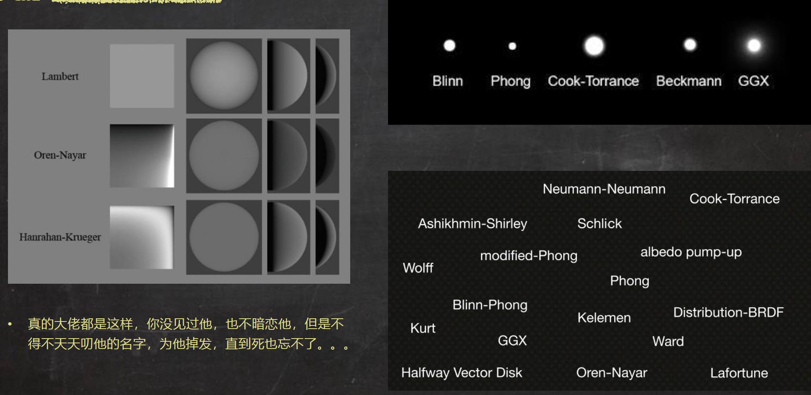

- [BRDF Explorer](https://github.com/wdas/brdf/downloads)

## 七

#### 环境光

- 三色环境光 ColAmbient

  ```
  3. 定义面板参数：
  • 贴图参数的定义方法：_XXX (“面板标签”, 2d) = “white” {}
  • “white”{} 代表缺省纹理为纯白贴图，其他还有“black”{}“gray”{} …
  
  9. 通过nDir计算朝上，朝下，侧面各部位遮罩；
  10. 通过部位遮罩混合最终环境光颜色；
  11. 采样Occlusion图，获得环境遮挡信息；采样贴图方法：tex2D(_Texture, uv)；
  ```

#### 投影

- Unity 内置投影调用

  ```
  6. 输出结构追加：LIGHTING_COORDS(0, 1)：
  • 此为Unity封装好的输出结构内容，照写就行，暂时不看细节；
  • 括号中的参入，如(0, 1)；0，1分别代表占用了TEXCOORD1和TEXCOORD2；
  7. 顶点Shader中必须调用Unity封装好的方法：TRANSFER_VERTEX_TO_FRAGMENT(o);
  8. 像素Shader中获取投影信息同样通过Unity提供的方法：LIGHT_ATTENUATION(i)；
  ```

#### OldSchoolPlus

- 光照的构成

  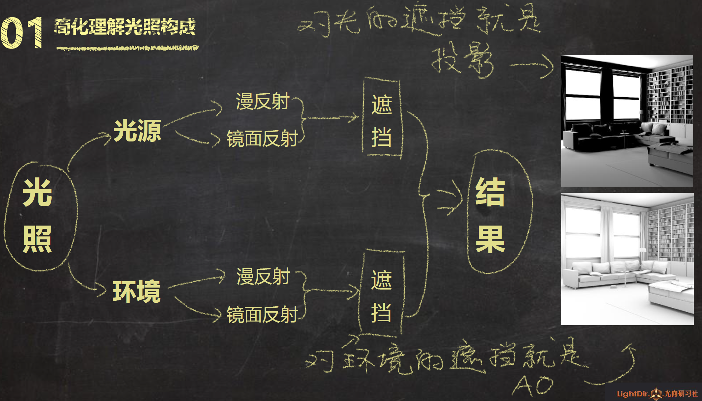

- OldSchoolPlus

  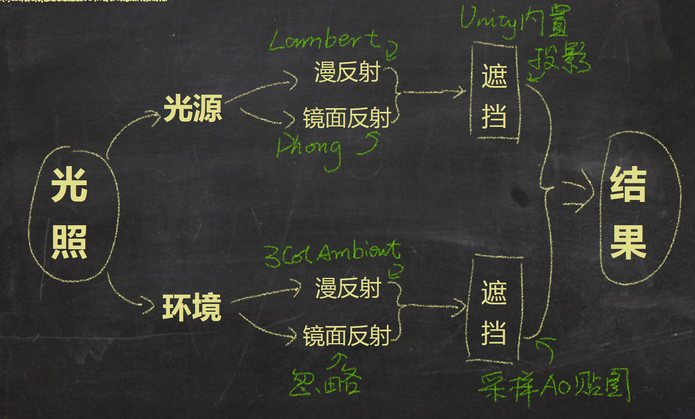

## 八

#### OldSchoolPlus

```
1. 分析构成：
    • OldSchoolPlus=OldSchoolP+3ColAmbient+Shadow；
    • 以OldSchoolP为模板，追加3ColAmbient，Shadow功能；
    • OldSchoolPlus_SF作为参考；

7. 像素Shader
    1. 向量，点积结果准备部分与OldSchoolP一致，不用改；
    2. 光照模型拆为直接光照环境光照两部分：
        1. 直接光照：在Lambert+Phong的基础上追加：
            • 投影：算法可Copy自L07_Shadow；
            • 光颜色：乘以_LightCol；
        2. 环境光照：算法可Copy自L07_3ColAmbient；
        3. 将直接光照和环境光照相加输出；
```

#### NormalMap 采样

```
5. 输入结构追加：
    1. UV0：用于采样法线贴图；
    2. Tangent：用于构建TBN矩阵；
6. 输出结构追加：
    1. UV0：用于采样法线贴图；
    2. tDirWS，bDirWS，nDirWS：切线空间3轴向方向，用于构建TBN矩阵；
```

## 九

#### 菲涅尔现象

真实世界中，除了金属之外其它物质，视线垂直于表面时，反射较弱，而当视线非垂直表面时，夹角越小，反射越明显。

#### Matcap

- 一种无视BRDF，将BRDF渲染结果，用View空间法线朝向，直接映射到模型表面的流氓算法；
-  常用来模拟环境反射；

```
1. 将nDir从切线空间转到观察空间；
2. 取RG通道Remap到(0~1)，作为UV对Matcap图采样；
3. 叠加菲涅尔效果，以模拟金属和非金属不同质感；
```

Cubemap

```
采样Cubemap；
• 采样方法：texCUBElod(_Cubemap, float4)；
• Float4参数：xyz：vrDir；w：mip等级；
```

## 十

#### OldSchoolPro

- 构成


```
3. 定义面板参数
• [Header(XXX)] 排版
4. 为产生投影，包含以下文件：
• AutoLight.cginc
• Lighting.cginc
```

## 十一、Shader 常用的写作技巧

#### 面板参数声明格式

```
数值，范围：
• _Name (“标签名”, float) = defaultVal
• _Name (“标签名”, range(min, max)) = defaultVal
• _Name (“标签名”, int) = defaultVal
位置，向量，颜色：
• _Name (“标签名”, vector) = (xVal, yVal, zVal, wVal)
• _Name (“标签名”, color) = (rVal, gVal, bVal, aVal)
2D，3D纹理，环境球：
• _Name (“标签名”, 2d) = “defaultTex” {}
• _Name (“标签名”, 3d) = “defaultTex” {}
• _Name (“标签名”, cube) = “defaultTex” {}
```

#### 参数属性

```
[HideInInspect]
• 用途：在面板上隐藏该参数；
• 可用于：任何参数；
• 例：[HideInInspect] _FakeLightDir (“伪光方向”, vector) = (0.0, 1.0, 0.0, 1.0)
[NoScaleOffset]
• 用途：禁用纹理的TilingOffset面板；不需要做TilingOffset的纹理，比如大部分的角色纹理，防止美术误设置；
• 可用于：纹理参数；
• 例：[NoScaleOffset] _MainTex (“主贴图”, 2d) = “white” {}
[Normal]
• 用途：标示该纹理参数为法线贴图，以激活相关自检功能；
• 可用于：2D纹理参数；
• 例：[Normal] _NormTex (“法线贴图”, 2d) = “bump”{}
[HDR]
• 用途：用于设置高动态范围颜色值；如：灯光颜色，自发光颜色等；
• 可用于：颜色参数；
• 例：[HDR] _EmitCol (“自发光颜色”, color) = (1.0, 1.0, 1.0, 1.0)
[Gamma]
• 用途：用于颜色参数的色彩空间的转换；一般用于色彩空间为Linear的项目；
• 可用于：颜色参数；
• 例：[Gamma] _EmitCol (“自发光颜色”, color) = (1.0, 1.0, 1.0, 1.0)
[PowerSlider(value)]
• 用途：对范围参数做Power处理后再传入Shader；纠正部分参数调节手感；
• 可用于：范围参数；
• 例：[PowerSlider(0.5)] _SpecPow (“高光次幂”, range(1, 90)) = 30
[Header(Label)]
• 用途：标签，用于排版；
• 可用于：单独使用；
• 例：[Header(Texture)]
[Space(value)]
• 用途：空行，用于排版；
• 可用于：单独使用；
• 例：[Space(50)]
其他：[Toggle] [Enum] [Keyword] 配合宏使用，暂时不用知道；自定义Drawer需要一定C#能力，暂时不用知道；
```

#### 参数类型

```
• fixed： 11位定点数，-2.0~2.0，精度1/256；
• half： 16位浮点数，-60000~60000，精度约3位小数；
• float： 32位浮点数，-3.4E38~3.4E38，精度约6，7位小数；
• Int： 32位整形数，较少使用；
• bool： 布尔型数，较少使用；
• 矩阵：
• float2x2, float3x3, float4x4, float2x3 诸如此类格式；
• half2x2, half3x3, half4x4, half2x3 诸如此类格式；
• 纹理对象：
• sampler2D： 2D纹理
• sampler3D： 3D纹理
• samplerCUBE： Cube纹理
```

#### 精度选择

```
• 原则上优先使用精度最低的数据类型；
• 经验：
• 世界空间位置和UV坐标，使用float；
• 向量，HDR颜色，使用half；视情况升到float；
• LDR颜色，简单乘子，可使用fixed；
```

#### 可访问的顶点 Input 数据

```
• POSITION 顶点位置float3 float4
• TEXCOORD0 UV通道1 float2 float3 float4
• TEXCOORD1 UV通道2 float2 float3 float4
• TEXCOORD2 UV通道3 float2 float3 float4
• TEXCOORD3 UV通道4 float2 float3 float4
• NORMAL 法线方向float3
• TANGENT 切线方向float4
• COLOR 顶点色float4
```

#### 常用的顶点 Output 数据

```
• pos 顶点位置CS float4
• uv0 一般纹理UV float2
• uv1 LighmapUV float2
• posWS 顶点位置WS float3
• nDirWS 法线方向WS half3
• tDirWS 切线方向WS half3
• bDirWS 副切线方向WS half3
• color 顶点色fixed4
```

#### 常用的顶点 Shader 操作

```
注：Unity2019.3.2f1版本
• pos o.pos = UnityObjectToClipPos(v.vertex);
• uv0 o.uv0 = v.uv0; o.uv0 = TRANSFORM_TEX(v.uv0, _MainTex);
• uv1 o.uv1 = v.uv1; o.uv1 = v.uv1 * unity_LightmapST.xy + unity_LightmapST.zw;
• posWS o.posWS = mul(unity_ObjectToWorld, v.vertex);
• nDirWS o.nDirWS = UnityObjectToWorldNormal(v.normal);
• tDirWS o.tDirWS = normalize(mul(unity_ObjectToWorld, float4(v.tangent.xyz, 0.0)).xyz);
• bDirWS o.bDirWS = normalize(cross(o.nDirWS, o.tDirWS) * v.tangent.w);
• color o.color = v.color;
```

## 十二、渲染大作业

### 双头食人魔渲染

#### 效果图

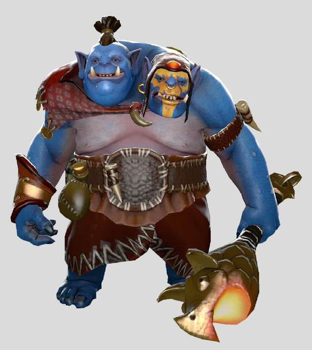

#### 纹理资源

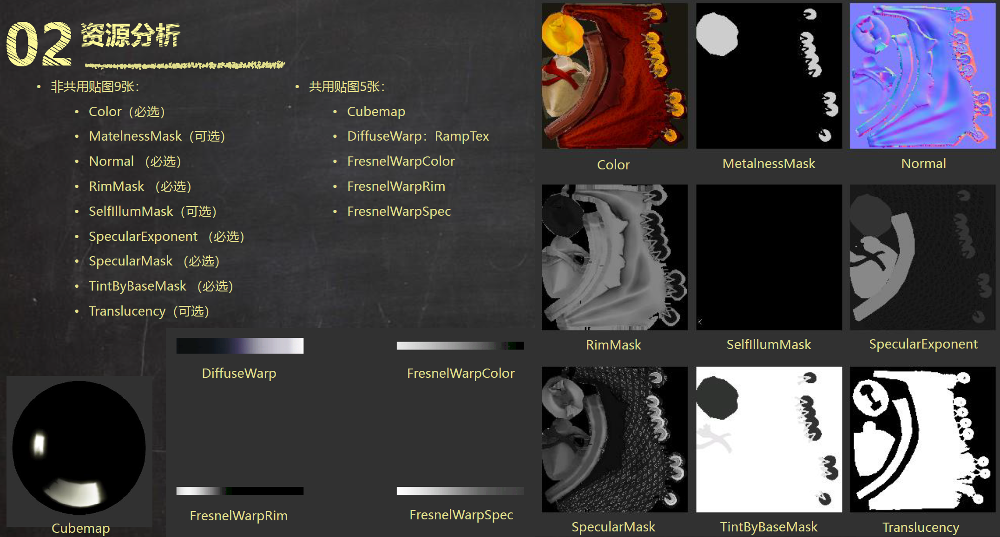

#### 资源优化


#### 光照模型

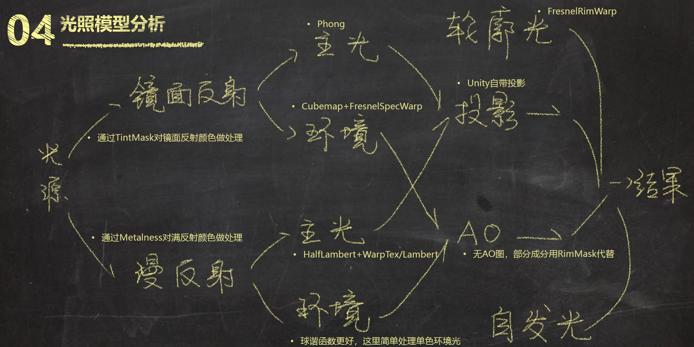

#### Code

##### Prepare

- Properties

  ```
  Properties {
      _MainTex ("RGB:颜色A:透贴", 2d) = "white"{}
      _MaskTex ("R:高光强度G:边缘光强度B:高光染色A:高光次幂", 2d) = "black"{}
      _NormTex ("RGB:法线贴图", 2d) = "bump"{}
      _MatelnessMask ("金属度遮罩", 2d) = "black"{}
      _EmissionMask ("自发光遮罩", 2d) = "black"{}
      _DiffWarpTex ("颜色Warp图", 2d) = "gray"{}
      _FresWarpTex ("菲涅尔Warp图", 2d) = "gray"{}
      _Cubemap ("环境球", cube) = "_Skybox"{}
  }
  ```

- property input

  ```
  #pragma target 3.0
  // 输入参数
  uniform sampler2D _MainTex;
  uniform sampler2D _MaskTex;
  uniform sampler2D _NormTex;
  uniform sampler2D _MatelnessMask;
  uniform sampler2D _EmissionMask;
  uniform sampler2D _DiffWarpTex;
  uniform sampler2D _FresWarpTex;
  uniform samplerCUBE _Cubemap;
  ```

- 向量准备

  ```
  half3 nDirTS = UnpackNormal(tex2D(_NormTex, i.uv0));
  half3x3 TBN = half3x3(i.tDirWS, i.bDirWS, i.nDirWS);
  half3 nDirWS = normalize(mul(nDirTS, TBN));
  half3 vDirWS = normalize(_WorldSpaceCameraPos.xyz - i.posWS);
  half3 vrDirWS = reflect(-vDirWS, nDirWS);
  half3 lDirWS = _WorldSpaceLightPos0.xyz;
  half3 lrDirWS = reflect(-lDirWS, nDirWS);
  // 中间量准备
  half ndotl = dot(nDirWS, lDirWS);
  half ndotv = dot(nDirWS, vDirWS);
  half vdotr = dot(vDirWS, lrDirWS);
  ```

- 纹理采样

  ```
  // 采样纹理
  half4 var_MainTex = tex2D(_MainTex, i.uv);
  half4 var_MaskTex = tex2D(_MaskTex, i.uv);
  half var_MatelnessMask = tex2D(_MatelnessMask, i.uv).r;
  half var_EmissionMask = tex2D(_EmissionMask, i.uv).r;
  half3 var_FresWarpTex = tex2D(_FresWarpTex, ndotv).rgb;
  half3 var_Cubemap = texCUBElod(_Cubemap, float4(vrDirWS, lerp(8.0, 0.0, var_MaskTex.a))).rgb;
  // 提取信息
  half3 baseCol = var_MainTex.rgb;
  half opacity = var_MainTex.a;
  half specInt = var_MaskTex.r;
  half rimInt = var_MaskTex.g;
  half specTint = var_MaskTex.b;
  half specPow = var_MaskTex.a;
  half matellic = var_MatelnessMask;
  half emitInt = var_EmissionMask;
  half3 envCube = var_Cubemap;
  half shadow = LIGHT_ATTENUATION(i);
  ```

##### Light Mode

- DiffCol SpecCol

  ```
  // 漫反射颜色镜面反射颜色
  half3 diffCol = lerp(baseCol, half3(0.0, 0.0, 0.0), matellic);
  half3 specCol = lerp(baseCol, half3(0.3, 0.3, 0.3), specTint) * specInt;
  ```

- Fresnel Power

  ```
  // 菲涅尔强度
  half3 fresnel = lerp(var_FresWarpTex, 0.0, matellic);
  half fresnelCol = fresnel.r; // 无实际用途
  half fresnelRim = fresnel.g;
  half fresnelSpec = fresnel.b;
  ```

- DirDiff 

  ```
  // 光源漫反射
  half halfLambert = ndotl * 0.5 + 0.5;
  half3 var_DiffWarpTex = tex2D(_DiffWarpTex, half2(halfLambert, 0.2));
  half3 dirDiff = diffCol * var_DiffWarpTex * _LightCol;
  ```

- DirSpec 

  ```
  // 光源镜面反射
  half phong = pow(max(0.0, vdotr), specPow * _SpecPow);
  half spec = phong * max(0.0, ndotl);
  spec = max(spec, fresnelSpec);
  spec = spec * _SpecInt;
  half3 dirSpec = specCol * spec * _LightCol;
  ```

- EnvDiff

  ```
  // 环境漫反射
  half3 envDiff = diffCol * _EnvCol * _EnvDiffInt;
  ```

- EnvSpec

  ```
  // 环境镜面反射
  half reflectInt = max(fresnelSpec, matellic) * specInt;
  half3 envSpec = specCol * reflectInt * envCube * _EnvSpecInt;
  ```

- RimLight

  ```
  // 轮廓光
  half3 rimLight = _RimCol * fresnelRim * rimInt * max(0.0, nDirWS.g) * _RimInt;
  ```

- Emission

  ```
  // 自发光
  half3 emission = diffCol * emitInt * _EmitInt;
  ```

- 最终混合

  ```
  // 混合
  half3 finalRGB = (dirDiff + dirSpec) * shadow + envDiff + envSpec + rimLight + emission;
  ```

  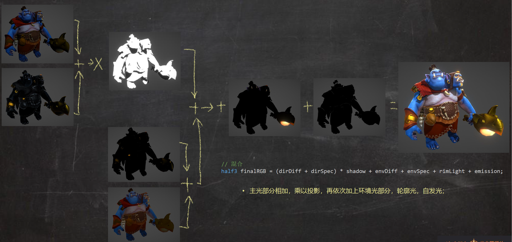

#### 其他细节

- Clip

  ```
  // 透明剪切
  clip(opacity - _Cutoff);
  ```

- 透明剪切投影修正

  - 如果是透明就丢弃该片段的渲染，但是还是需要写入 ShadowMap，退回到一个简单的也能写入 ShadowMap 的 Shader

  ```
  // 声明回退Shader
  FallBack "Legacy Shaders/Transparent/Cutout/VertexLit"
  ```

- 双面显示

  ```
  PassTags 后声明 Cull 模式 - Cull Off；
  ```

#### 效果完成

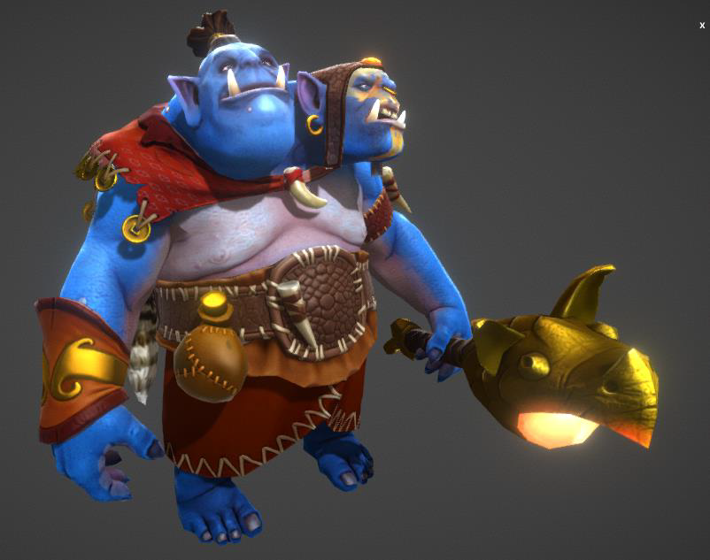

### 开源 Shader 

SP，SD都有 GLSL 的 Shader 源码

## 十三、特效

#### 特效分类

- 透

  - AB
  - AD
  - AC

  

- 动

  - 参数动画
  - UV动画
    - UV流动
    - UV扰动
    - 序列帧动画
  - 顶点动画
    - 顶点位置动画
    - 顶点颜色动画

- 映

  - 极坐标
  - 屏幕坐标 UV
  - 透明扭曲

#### 透切 AlphaCutout ：AC

渲染实体，透明度小于阈值，丢弃该片段渲染

- 优点：
  - 没有排序问题；
- 缺点：
  - 边缘效果太实，锯齿
  - 移动端性能较差；

```
Tags {
    "RenderType"="TransparentCutout" // 对应改为Cutout
    "ForceNoShadowCasting"="True" // 关闭阴影投射
    "IgnoreProjector"="True" // 不响应投射器
}
```

```
half4 var_MainTex = tex2D(_MainTex, i.uv); // 采样贴图RGB颜色A透贴
clip(var_MainTex.a - _Cutoff); // 透明剪切
```

#### 透混 AlphaBlend AB

- 优点：
  - 移动端性能较好；
  - 边缘效果较好
- 缺点：
  - 有排序问题；

```
Tags {
"Queue"="Transparent" // 调整渲染顺序
"RenderType"="Transparent" // 对应改为Cutout
"ForceNoShadowCasting"="True" // 关闭阴影投射
"IgnoreProjector"="True" // 不响应投射器
}
```

```
Blend One OneMinusSrcAlpha // 修改混合方式One/SrcAlpha OneMinusSrcAlpha
```

#### 透叠

- 用途：
  - 常用于发光体，辉光的表现；
  - 一般的特效表现，提亮用；
- 问题：
  - 有排序问题；
  - 多层叠加容易堆爆性能(OverDraw)；
  - 作为辉光效果，通常可用后处理代替；

```
Blend One One // 修改混合方式
```

#### 更多混合模式

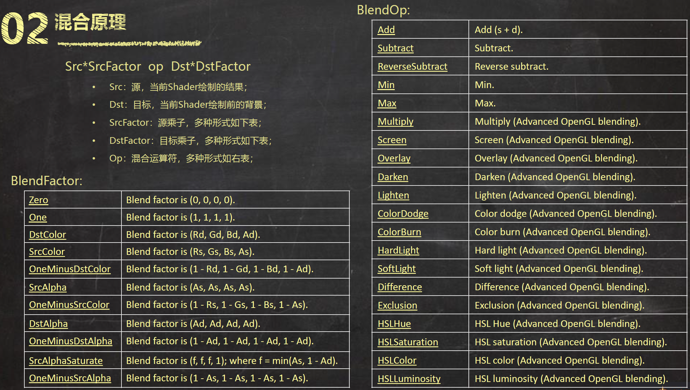

#### Shader 面板

```
Properties {
    _MainTex ("RGB：颜色A：透贴", 2d) = "gray"{}
    [Enum(UnityEngine.Rendering.BlendMode)]
    _BlendSrc ("混合源乘子", int) = 0
    [Enum(UnityEngine.Rendering.BlendMode)]
    _BlendDst ("混合目标乘子", int) = 0
    [Enum(UnityEngine.Rendering.BlendOp)]
    _BlendOp ("混合算符", int) = 0
}
```

```
BlendOp [_BlendOp] // 可自定义混合算符
Blend [_BlendSrc] [_BlendDst] // 可自定义混合模式
```

#### 常用混合模式

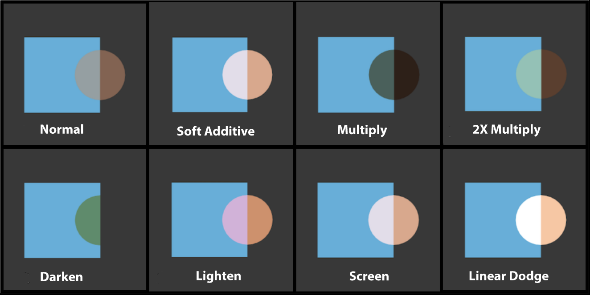

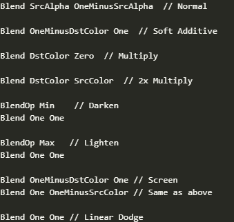

## 十四、无

## 十五、透明问题和 UV 流动

#### UV 流动

##### GhostFlow

```
o.uv0 = v.uv; // uv0 为原生 uv
o.uv1 = TRANSFORM_TEX(v.uv, _WarpTex); // UV1支持TilingOffset
o.uv1.y = o.uv1.y + frac(-_Time.x * _FlowSpeed);// UV1 用来流动 UV
```

```
// 噪声处理
half3 finalRGB = var_MainTex.rgb;
half noise = lerp(1.0, var_NoiseTex * 2.0, _NoiseInt); // Remap噪声
noise = max(0.0, noise); // 截去负值
half opacity = var_MainTex.a * _Opacity * noise;
```

#### UV 扰动

##### GhostWrap

vertex shader 与 GhostFlow 类似

```
// 使用 WarpTex 来扰动 UV
half3 var_WarpTex = tex2D(_WarpTex, i.uv1).rgb; // 噪声图
float2 uvBias = (var_WarpTex - 0.5) * _WarpInt; // 计算UV偏移值
float2 uv0 = i.uv0 + uvBias; // 应用UV偏移量
half4 var_MainTex = tex2D(_MainTex, uv0); // 偏移后UV采样MainTex
```

